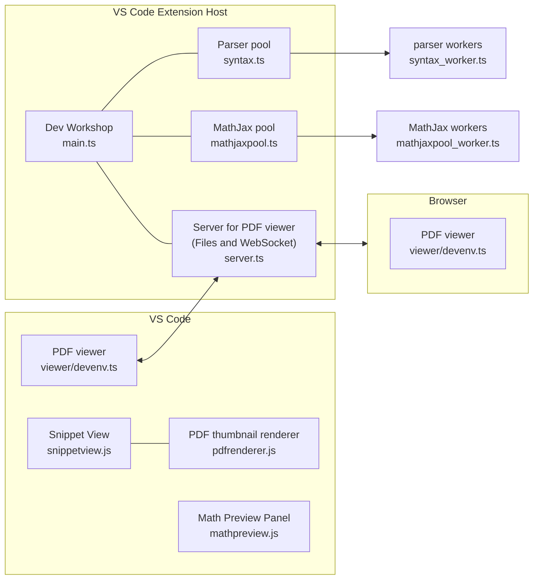
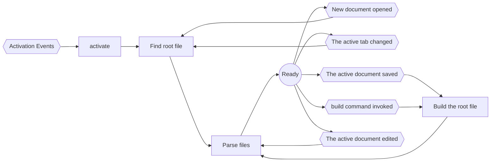

# Overview

[Providers](https://code.visualstudio.com/api/language-extensions/programmatic-language-features#language-features-listing) are defined under `providers/` and are registered in `main.ts`. All other components of the extension are defined under `components/` and are properties of the `Extension` class defined in `main.ts`, which can be accessed when needed. The `Extension` class is a kind of [service locator](https://martinfowler.com/articles/injection.html#UsingAServiceLocator).

## Root file

Where Dev Workshop differs from other extensions of VS Code is in treating the root file. For other extensions of programming languages, generally, there is only one compilation target per workspace. However, Dev Workshop dynamically detects the root file and the target depending on the document being currently edited. See [wiki](https://github.com/khulnasoft/devenv/wiki/Compile#the-root-file) for the details. `Manager.findRoot()` does the job. We register `findRoot` with `onDidChangeActiveTextEditor` in `main.ts`. This works well with multi-root workspaces.

## Application Log

When something goes wrong, we always add to log messages what went wrong with `Logger.log()`. It is much beneficial for debugging.

## VS Code filesystem and virtual workspaces

See [#2669](https://github.com/khulnasoft/devenv/pull/2669).

## EventBus

See [#3193](https://github.com/khulnasoft/devenv/pull/3193).

## workerpool

To avoid blocking the main loop of the extension host process, we execute some heavy tasks in child processes with [workerpool](https://github.com/josdejong/workerpool).

See:

- https://github.com/khulnasoft/devenv/tree/master/src/components/parser
- https://github.com/khulnasoft/devenv/tree/master/src/providers/preview

## Architecture

## flowchart

